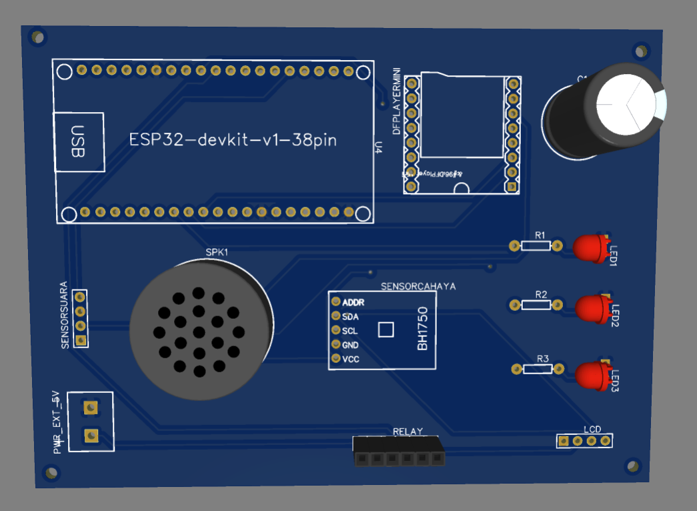
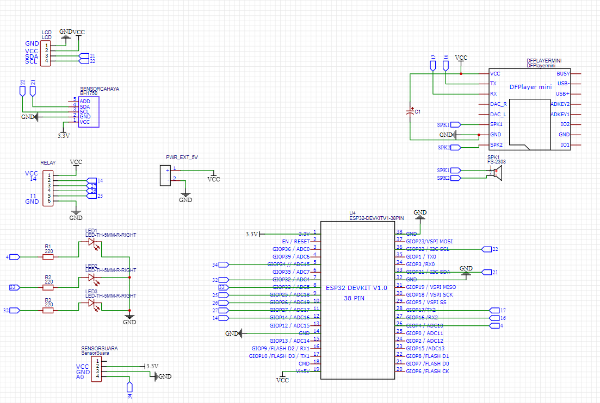

# Smart Library Monitoring System

## Overview
An IoT-based library monitoring system using ESP32.

This system detects excessive noise levels in the library, automatically controls lighting based on ambient light conditions,
and provides remote monitoring through Telegram.

## Features
- Noise detection
- Automatic lighting control
- Telegram bot integration
- Real-time monitoring
- An automatic warning will be issued if high noise levels are detected.

## Hardware
- ESP32
- Sound Sensor (KY-037 / FC-04)
- LDR Sensor
- Relay Module 4 chanel
- dfPlayer mini
- Speaker mini 8 ohm
- 4 lamp AC
- 3 LED
- Resistor 220 ohm (4 pcs)
## Software
- Arduino IDE
- Telegram Bot API

## PCB Design

## Skematic wiring

